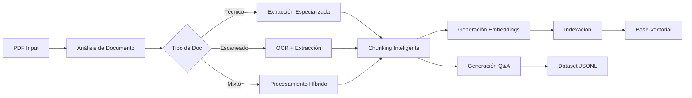

# technical_rag_system
Proyecto de RAG  y agente de generación de qa para finetunning
# Technical Documentation RAG System

<div align="center">


Sistema avanzado de Recuperación Aumentada por Generación (RAG) especializado en el procesamiento inteligente de documentación técnica en PDF, con capacidades multimodales y generación automática de datasets Q&A.

</div>

## 🚀 Características Principales

### 📄 Procesamiento de Documentos
- **Análisis Adaptativo**: Detecta automáticamente el tipo de documento (técnico, texto, escaneado, mixto) y aplica la estrategia óptima
- **Extracción Multimodal**: 
  - ✅ Texto con chunking inteligente y preservación de contexto
  - ✅ Tablas con estructura preservada (exportación a CSV)
  - ✅ Imágenes raster embebidas
  - ✅ Diagramas técnicos renderizados con alta calidad
  - ✅ OCR automático para documentos escaneados

### 🔍 Sistema de Búsqueda
- **Búsqueda Híbrida**: Combina búsqueda vectorial semántica con búsqueda por palabras clave
- **Almacenamiento Dual**: SQLite para metadatos estructurados y ChromaDB para embeddings vectoriales
- **Indexación Inteligente**: Índices optimizados por manual, página y sección

### 🤖 Generación de Q&A
- **Dataset Automático**: Generación de 21,778+ pares pregunta-respuesta de alta calidad
- **Múltiples Tipos**: Preguntas factuales, de síntesis, causales, de aplicación y análisis
- **Validación de Calidad**: Filtrado automático y scoring de relevancia
- **Soporte Multi-chunk**: Preguntas que integran información de múltiples fuentes

## 📋 Requisitos del Sistema

### Hardware
- **RAM**: 8GB mínimo (16GB recomendado)
- **Almacenamiento**: 10GB+ espacio libre
- **CPU**: 4+ cores recomendados para procesamiento paralelo

### Software
- Python 3.8+
- Sistema operativo: macOS, Linux, Windows
- Java (opcional, para extracción avanzada de tablas)
- Tesseract OCR (opcional, para documentos escaneados)

## 🔧 Instalación

### 1. Clonar el Repositorio

```bash
git clone https://github.com/tu-usuario/technical-rag-system.git
cd technical-rag-system
```

### 2. Configurar Entorno Virtual

```bash
python -m venv venv_rag
source venv_rag/bin/activate  # En Windows: venv_rag\Scripts\activate
```

### 3. Instalar Dependencias

```bash
pip install -r requirements.txt
```

### 4. Instalar Dependencias del Sistema (Opcional)

**Tesseract OCR** (para documentos escaneados):
```bash
# macOS
brew install tesseract

# Ubuntu/Debian
sudo apt-get install tesseract-ocr tesseract-ocr-spa

# Windows
# Descargar desde: https://github.com/UB-Mannheim/tesseract/wiki
```

### 5. Configurar Variables de Entorno

```bash
cp .env.example .env
# Editar .env con tu API key de OpenAI (para generación Q&A)
```

### 6. Inicializar el Sistema

```bash
python scripts/init_system.py
```

## 📖 Uso Rápido

### Procesar Manuales PDF

```bash
# Procesar todos los PDFs en un directorio
python scripts/process_manuals_sqlite.py --pdf-dir data/raw_pdfs/

# Procesar un PDF específico con metadatos
python scripts/process_manuals_sqlite.py --single-pdf manual.pdf \
  --manufacturer "Beckhoff" --model "AX5000" --embeddings
```

### Construir Base de Datos Vectorial

```bash
# Construir base vectorial completa
python scripts/build_vectordb_sqlite.py

# Ver estadísticas
python scripts/build_vectordb_sqlite.py --stats
```

### Generar Dataset Q&A

```bash
cd qa_generator
python process_all_chunks_v4.py --model gpt-3.5-turbo --batch-size 3
```

## 📁 Estructura del Proyecto

```
technical-rag-system/
├── config/                 # Configuración del sistema
│   └── settings.py         # Parámetros centralizados
├── core/                   # Componentes principales
│   ├── embedding_pipeline.py
│   ├── hybrid_search.py
│   └── intelligent_chunking.py
├── data/                   # Almacenamiento de datos
│   ├── raw_pdfs/          # PDFs originales
│   ├── processed/         # Contenido procesado por manual
│   │   └── Manual_*/      # Carpeta por cada manual
│   │       ├── images/    # Imágenes extraídas
│   │       ├── diagrams/  # Diagramas renderizados
│   │       └── tables/    # Tablas en CSV
│   ├── vectordb/          # Base vectorial ChromaDB
│   └── sqlite/            # Base de datos SQLite
├── database/              # Gestión de base de datos
│   └── sqlite_manager.py
├── extractors/            # Extractores de contenido
│   ├── adaptive_processor.py
│   ├── pdf_extractor.py
│   └── table_extractor.py
├── qa_generator/          # Generación de datasets Q&A
│   ├── qa_generator.py
│   ├── chunk_manager.py
│   └── prompt_templates.py
├── scripts/               # Scripts ejecutables
│   ├── init_system.py
│   ├── process_manuals_sqlite.py
│   └── build_vectordb_sqlite.py
└── vectorstore/           # Gestión de vectores
    ├── vector_manager.py
    └── retrieval.py
```

## 🗄️ Base de Datos

### Esquema SQLite

El sistema utiliza las siguientes tablas principales:

- **manuals**: Información de manuales procesados
- **content_blocks**: Bloques de texto extraídos con posición
- **content_chunks**: Fragmentos optimizados para búsqueda
- **images**: Metadatos de imágenes y diagramas
- **tables**: Información de tablas extraídas
- **document_analysis**: Análisis del tipo de documento
- **processing_logs**: Historial de procesamiento

## 🔬 Flujo de Procesamiento



## 📊 Rendimiento

### Estadísticas de Procesamiento Real

- **Documentos procesados**: 3 manuales técnicos complejos
- **Total chunks generados**: 4,558
- **Imágenes extraídas**: 1,611 (raster + diagramas)
- **Tablas procesadas**: 1,244
- **Dataset Q&A generado**: 21,778 pares
- **Tiempo de procesamiento PDF**: ~2 horas/manual
- **Tiempo generación Q&A**: ~48 horas (con rate limits)

### Optimización de Memoria

```python
# En config/settings.py
BATCH_SIZE = 32        # Ajustar según RAM disponible
MAX_WORKERS = 4        # Paralelismo según CPU
CHUNK_SIZE = 512       # Tamaño óptimo de chunks
CHUNK_OVERLAP = 50     # Solapamiento para contexto
```

## 🛠️ Configuración Avanzada

### Ajustar Modelos de Embeddings

```python
# config/settings.py
EMBEDDING_MODEL = "sentence-transformers/paraphrase-multilingual-MiniLM-L12-v2"
EMBEDDING_DIMENSION = 384
```

### Tipos de Chunks Adaptativos

```python
ADAPTIVE_CHUNK_SIZES = {
    'technical_diagram_heavy': 1024,
    'text_heavy': 512,
    'table_heavy': 768,
    'scanned': 768,
    'mixed': 512
}
```

